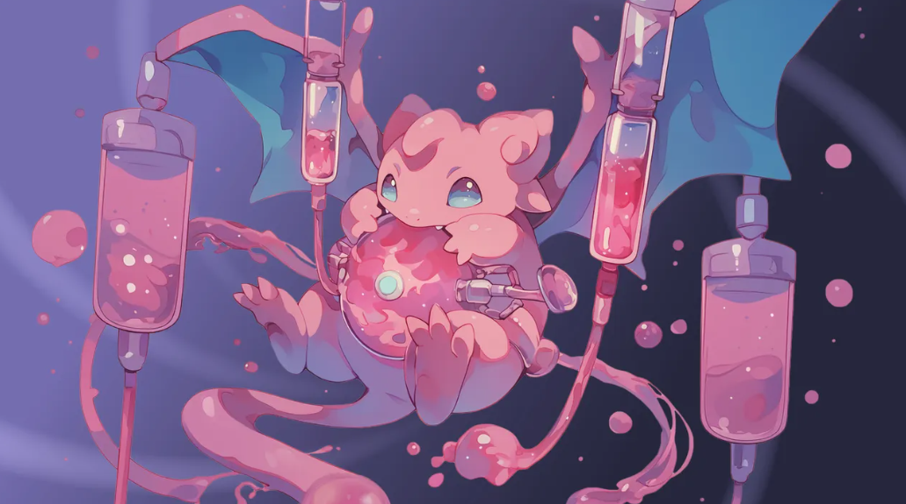
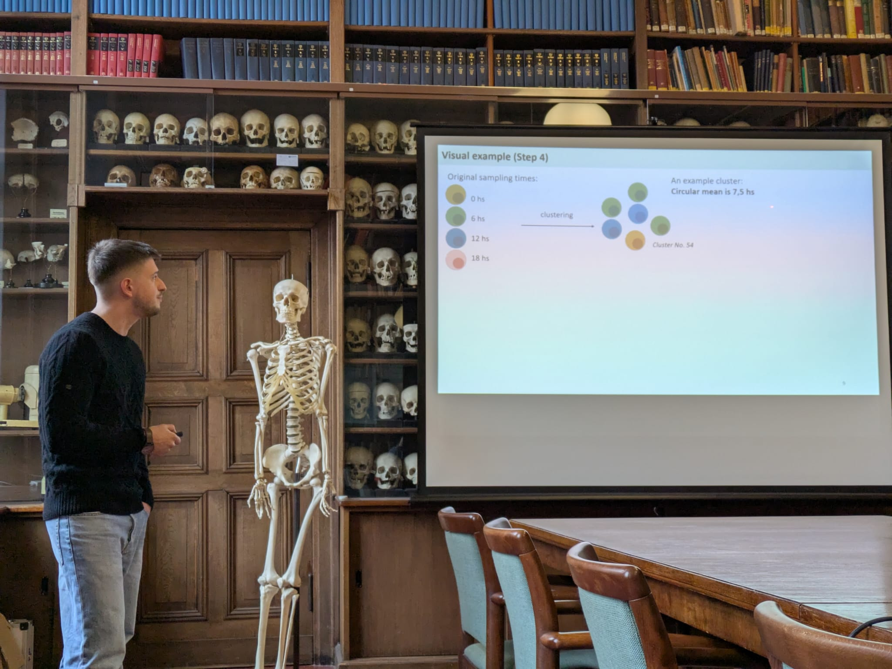
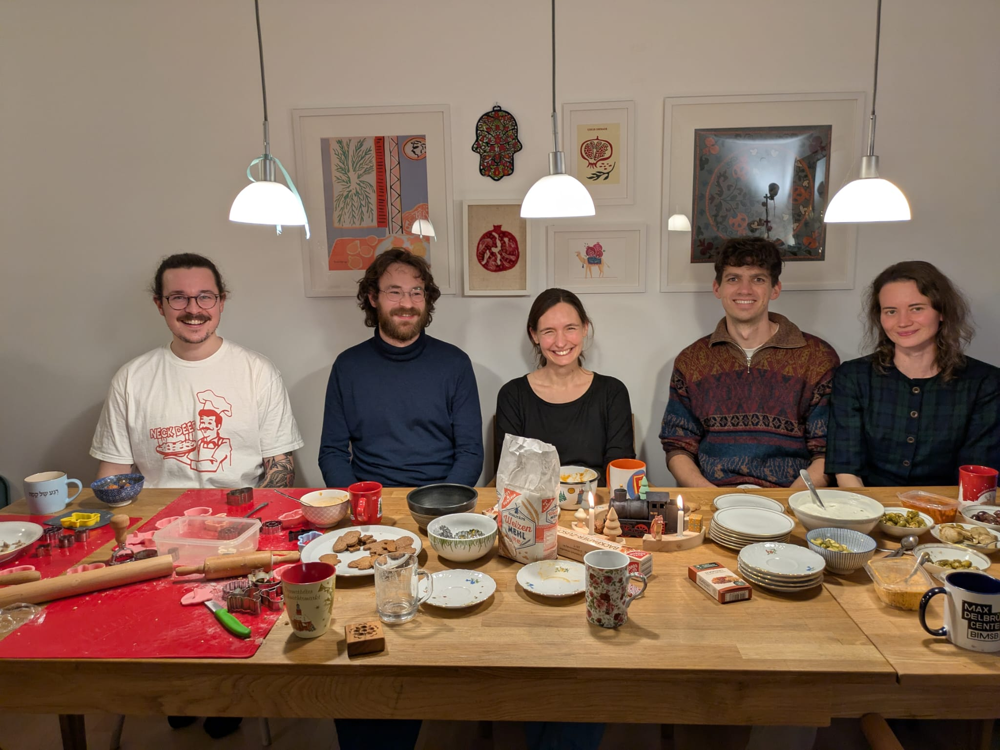

### Buchauer Lab News Archive

__June 28th 2025__
Lab members Mark, Jonathan and Lisa, together with departmental friends Lara and Josua, participated in Charité's Long Night of Science and explained the immune system to an estimated 70 kids and their parents. Quite exhausting, but also very rewarding! Meanwhile, Roberta participated in the Science Slam where she talked about circadian single cell research.

__May 20th 2025__
We went on a group excursion hiking along Wannsee and crossing to the Peacock Island where we had a delicious picnic :-)

__May 13th 2025__
... and Roberta won the ISCO 2025 jury's poster prize!

__May 12th 2025__
We attended the Innovations in Single-Cell Omics conference in Berlin where Jonathan, Roberta and Mark & Constantin presented their work on posters...

__March 2nd 2025__
Welcome [Roberta](https://libuchauer.github.io/team), who is joining us for her MD thesis research!

__February 1st 2025__
Welcome [Ishminder](https://libuchauer.github.io/team), who is joining us for his master's thesis in Molecular Medicine!

__January 18th 2025__
As a member of the [Young Academy](https://www.diejungeakademie.de), Lisa participated in the BBAW's scientific new year's reception, the [Salon Sophie Charlotte](https://salon.bbaw.de/start). This year's event was themed "Metamorphoses", and the members of the Young Academy invited visitors to engange with their research via a specially designed card game, [MetaMonster](https://diejungeakademie.de/de/projekte/salon-sophie-charlotte/salon-sophie-charlotte-2025). 
  

  
__January 17th 2025__
Congratulations to George, who successfully defended his master's thesis entitled "High-resolution reconstruction of circadian gene expression profiles from sparse single-cell data" as part of his studies in Molecular Medicine! First graduate from the lab :-)
  

 
__December 13th 2024__
To celebrate the end of the year, we baked a lot of cookies and Stockbrot!
  

  
__August 19th 2024__
Welcome [Ani](https://libuchauer.github.io/team), who is joining us for a lab rotation as part of her M. Sc. studies in Molecular Medicine!

__June 24th 2024__
[Lisa]((https://libuchauer.github.io/team)) was admitted to the ["Junge Akademie"](https://www.diejungeakademie.de/en/press/zehn-neue-mitglieder-in-junge-akademie-aufgenommen), the German academy for Early Career Researchers supported by the Berlin-Brandenburg Academy of Sciences (BBAW) and the German National Academy of Sciences Leopoldina. For five years, she will have the opportunity to engage in interdisciplinary projects at the interface of science and society. Read Charité's press release [here](https://www.charite.de/forschung/themen_forschung/2024/lisa_buchauer_ist_mitglied_der_jungen_akademie/).

__April 18th 2024__
Welcome [Alice](https://libuchauer.github.io/team), who is joining us for a lab rotation as part of her master's in Health IT Engineering in Grenoble.

__April 15th 2024__
Today, we welcome our first MD student, [Jonathan](https://libuchauer.github.io/team), as well as [George](https://libuchauer.github.io/team), who will be doing this master's thesis with us. Good to have both of you!

__April 1st 2024__
A warm welcome to [Elton](https://libuchauer.github.io/team), who is joining us for a lab rotation as part of his master's in Bioinformatics.

__March 16th 2024__
Welcome to [Mae](https://libuchauer.github.io/team) who is joining us for a lab rotation as part of her master's in Molecular Medicine!

__Dec 1st 2023__
We welcome [Liliia](https://libuchauer.github.io/team) to the lab! Great to have you with us :)

__Nov 1st 2023__
The group size doubles with [Mark](https://libuchauer.github.io/team) joining the group, welcome!

__May 15th 2023__
Hello world!