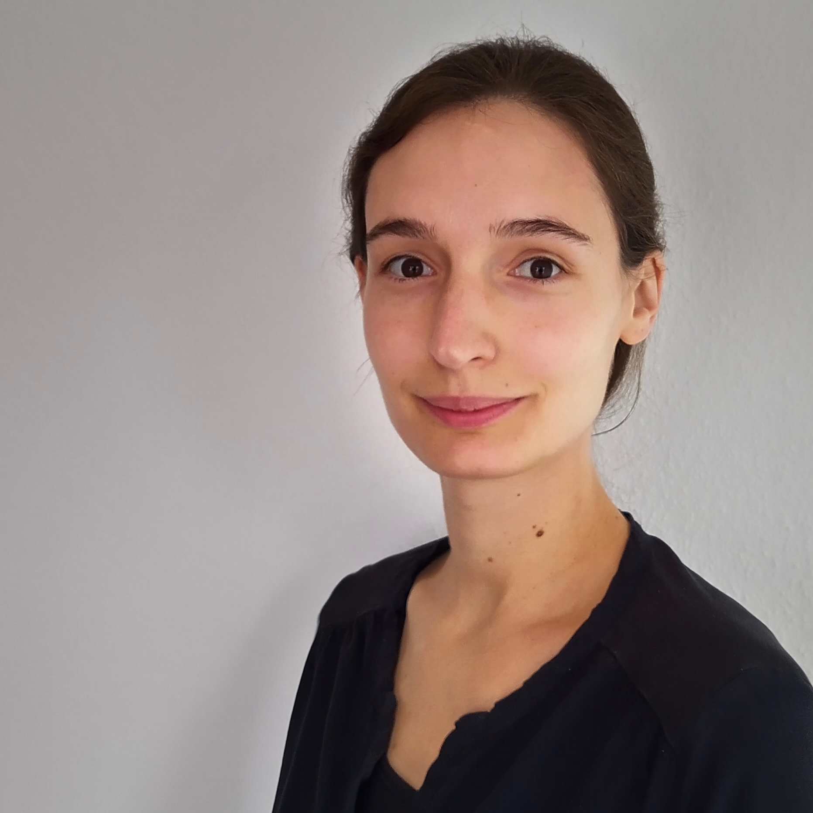

### Welcome!

I am a Computational Biologist at [immunai](https://www.immunai.com/) in Tel Aviv. Previously, I was a postdoctoral research fellow at the Weizmann Institute of Science and, before that, a PhD student at the German Cancer Research Center.  

As a computational biologist with a background in physics, I develop computational methods for omics data, analyse such data, and build mathematical models of biological systems.

You can contact me via [email](mailto:buchauer@posteo.de) or [twitter](http://twitter.com/libuchauer).

### cellanneal

If you have bulk RNAseq data that you want to deconvolve and are looking for a method that is accurate, fast and, above all, user-friendly, please check out [cellanneal](https://github.com/LiBuchauer/cellanneal) and the accompanying [pre-print](https://arxiv.org/abs/2110.08209)

