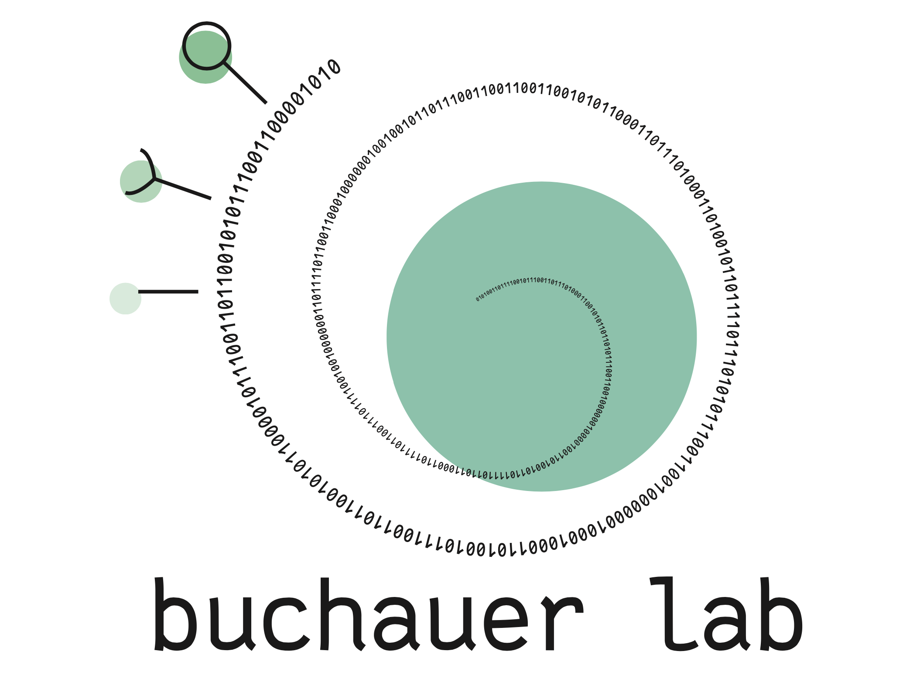
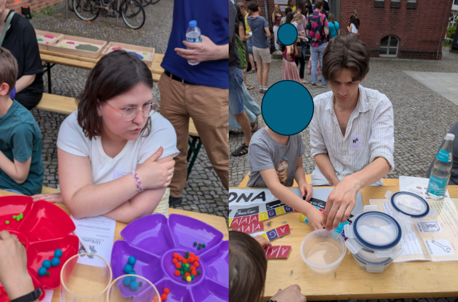
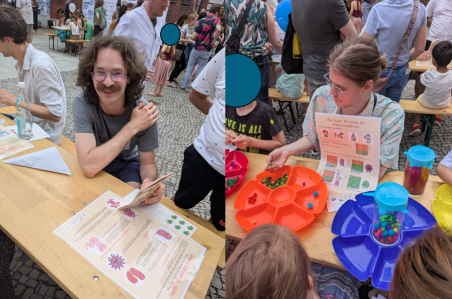
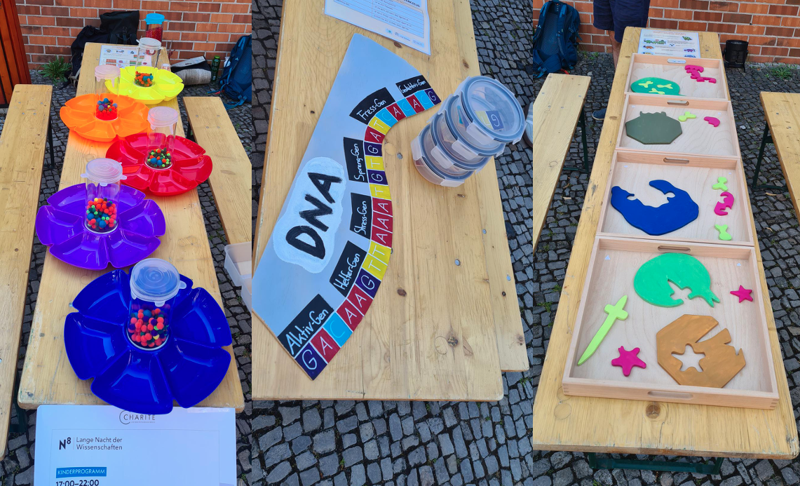
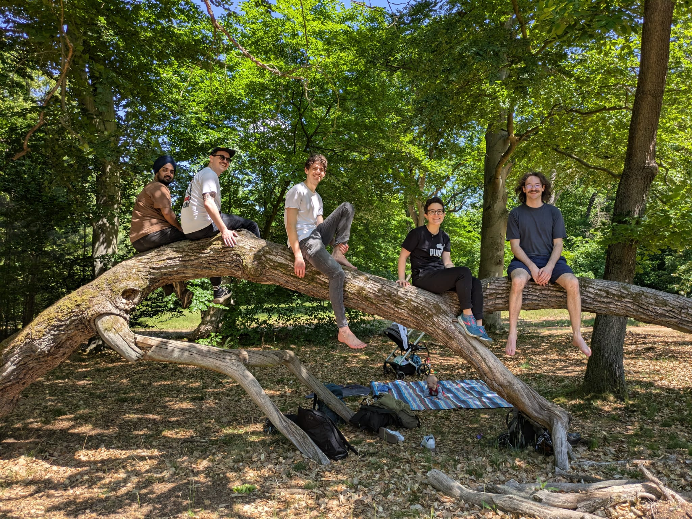
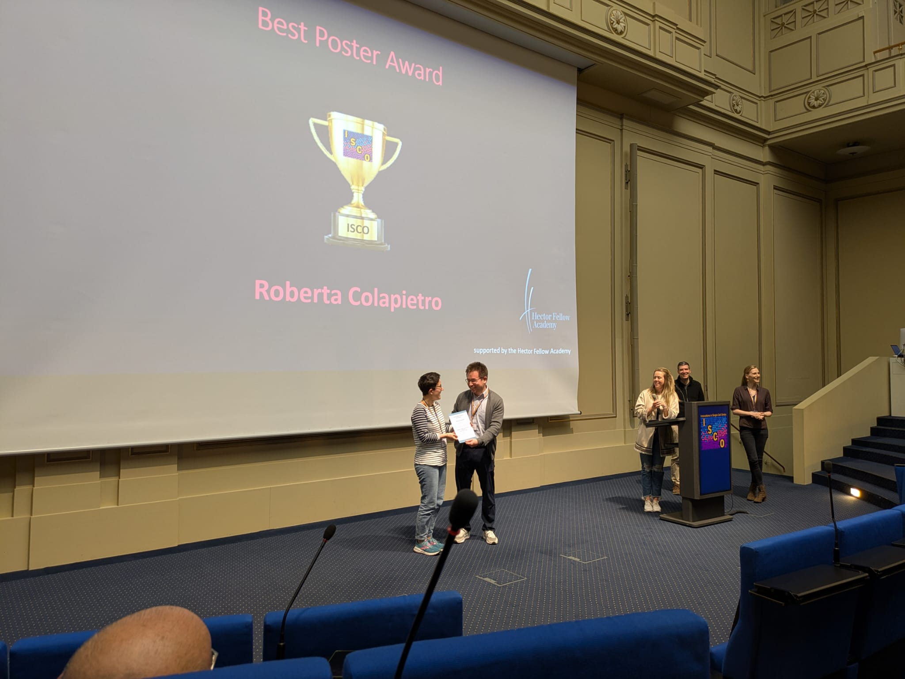
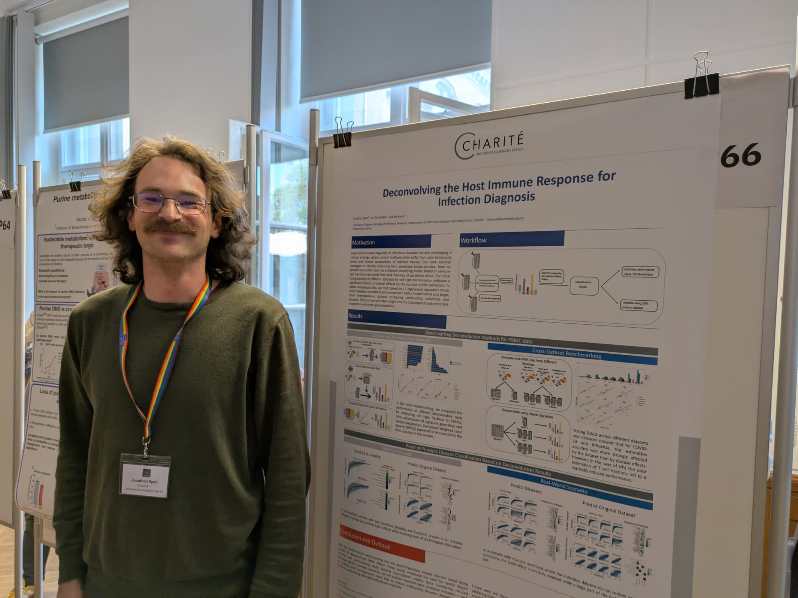
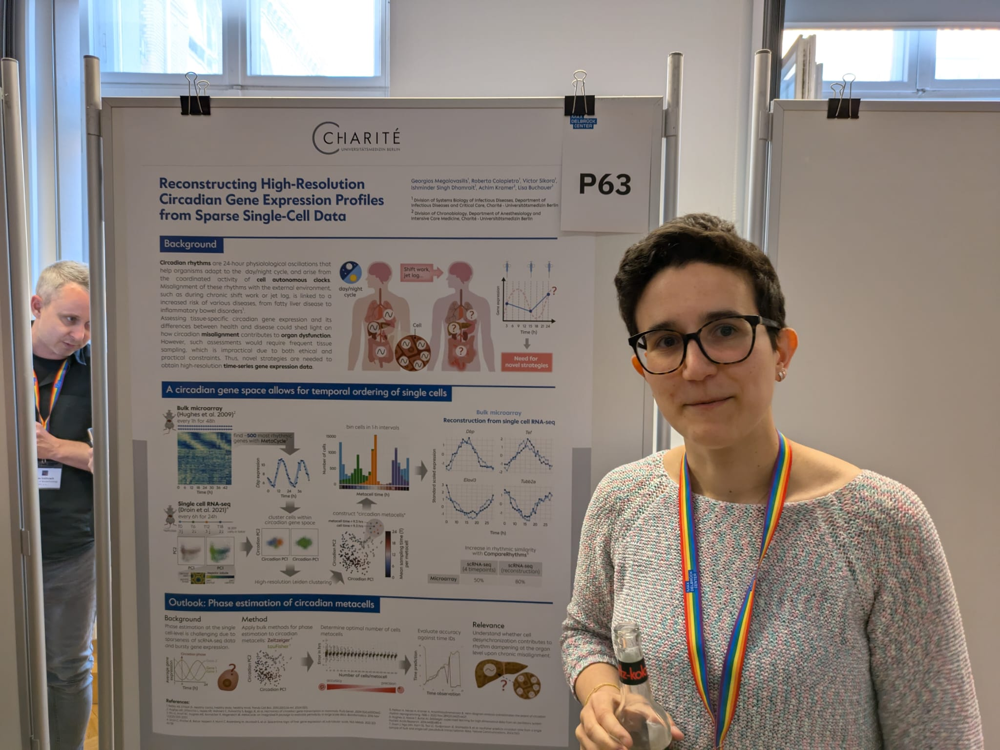
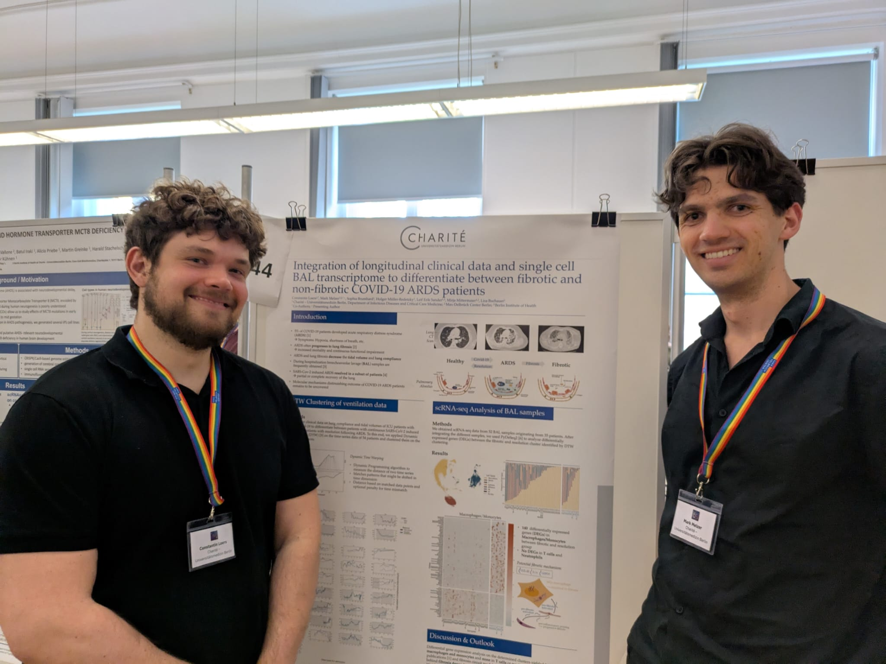

### Welcome!

We are a theoretical research group working in computational immunology. We develop computational tools for the analysis of omics and flow data. We also collaborate with experimentalists and clinicians on translational infectious disease & fundamental immunology research projects. 

Our research includes analyzing, modeling, and interpreting high-dimensional biomedical datasets, comprising single-cell or bulk omics assays, spatial assays, flow cytometry data and more. Approaches employed by and developed in our lab include - but are not limited to - mathematical models, computer simulations, and machine learning methods. 

In computational method development, our primary objective is to create tools that facilitate the informative fusion of data from various sources, such as different modalities, technologies or diseases. We conceive, prototype and develop algorithms to this end, but also emphasize thorough benchmarking, usability, reproducibility and maintenance.

### News
__August 1st 2025__
Welcome [Iman](https://libuchauer.github.io/team), who is joining us for a lab rotation!

__June 28th 2025__
Lab members Mark, Jonathan and Lisa, together with departmental friends Lara and Josua, participated in Charité's Long Night of Science and explained the immune system to an estimated 70 kids and their parents. Quite exhausting, but also very rewarding! Meanwhile, Roberta participated in the Science Slam where she talked about circadian single cell research.

__May 20th 2025__
We went on a group excursion hiking along Wannsee and crossing to the Peacock Island where we had a delicious picnic :-)

__May 13th 2025__
... and Roberta won the ISCO 2025 jury's poster prize!

__May 12th 2025__
We attended the Innovations in Single-Cell Omics conference in Berlin where Jonathan, Roberta and Mark & Constantin presented their work on posters...

__March 2nd 2025__
Welcome [Roberta](https://libuchauer.github.io/team), who is joining us for her MD thesis research!

__February 1st 2025__
Welcome [Ishminder](https://libuchauer.github.io/team), who is joining us for his master's thesis in Molecular Medicine!

__For older items, see the [Lab Chronicle](https://libuchauer.github.io/chronicle).__

