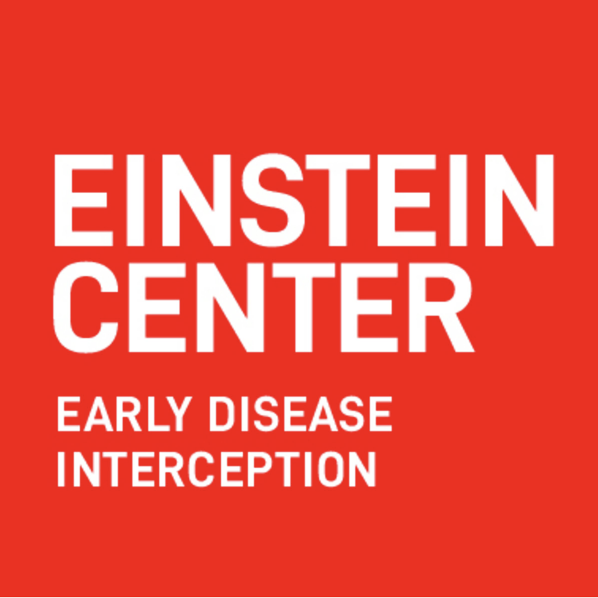

### Welcome!

We are a theoretical research group working in computational immunology. We develop computational tools for the analysis of omics and flow data. We also collaborate with experimentalists and clinicians on translational infectious disease & fundamental immunology research projects. 

Our research includes analyzing, modeling, and interpreting high-dimensional biomedical datasets, comprising single-cell or bulk omics assays, spatial assays, flow cytometry data and more. Approaches employed by and developed in our lab include - but are not limited to - mathematical models, computer simulations, and machine learning methods. 

In computational method development, our primary objective is to create tools that facilitate the informative fusion of data from various sources, such as different modalities, technologies or diseases. We conceive, prototype and develop algorithms to this end, but also emphasize thorough benchmarking, usability, reproducibility and maintenance.

### News
__January 7th 2026__
We are currently looking for a new PhD student in Machine Learning for Immunology together with the lab of Simon Haas as part of the new [Einstein Center for Early Disease Interception](https://www.einsteinfoundation.de/en/fellows-projects/einstein-centers/einstein-center-for-early-disease-interception). The desired start date is March or April 2026. Check out the [details](https://libuchauer.github.io/join) and apply!

__December 18th 2025__
Together with the Mittnenzweig lab from MDC-BIMSB, we gathered for our annual end of year party including a bonfire and Stockbrot. Happy new year to everyone!

__December 12th 2025__
We are currently recruiting a bioinformatics student assistant (40 hrs/month). For more details see [here](https://buchauer-lab.eu/join/).

__November 17th 2025__
Welcome [Mona](https://libuchauer.github.io/team), who is joining us for a lab rotation!

__November 13th 2025__
Lisa had the opportunity to present our [Exit Game](https://libuchauer.github.io/resources) at an [Open Lab Evening of Futurium](https://futurium.de/de/open-lab-abend/open-lab-abend-zukunftsvisionen-der-wissenschaftskommunikation/open-lab-abend-zukunftsvisionen-der-wissenschaftskommunikation) in Berlin.

__October 15th 2025__
Welcome [Aristotelis](https://libuchauer.github.io/team), who is joining us as a postdoc as a part of the [Circadian Medicine CRC](https://libuchauer.github.io/team).  

__September 26th 2025__
We finished teaching our new course Single-Cell Data Analysis for Beginners to 16 Charité doctoral students and scientists for the first time and received overall very positive reviews! The course was developed jointly with Anika Neuschulz from BIH and the [course materials](https://buchauer-lab.github.io/charite-sc-data-course/) are available online.  

__August 1st 2025__
Welcome [Iman](https://libuchauer.github.io/team), who is joining us for a lab rotation!

__For older items, see the [Lab Chronicle](https://libuchauer.github.io/chronicle).__

