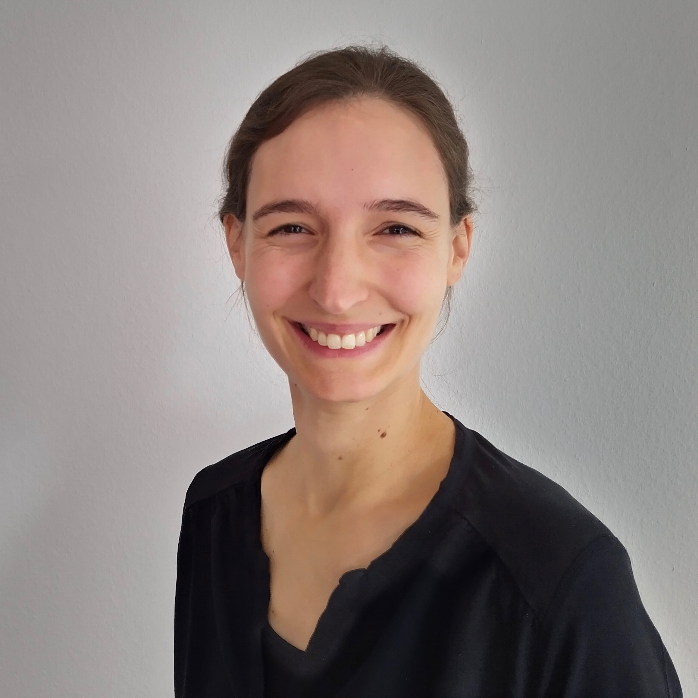

### Welcome!

I am a postdoctoral research fellow at the Weizmann Institute of Science working in the group of [Systems Biology of Mammalian Tissues](http://shalevlab.weizmann.ac.il/) led by Shalev Itzkovitz.
As a computational biologist with a background in physics, I develop computational methods for genomics data, analyse such data, and build mathematical models of biological systems.

You can contact me via [email](mailto:lisa.buchauer@weizmann.ac.il) or [twitter](http://twitter.com/libuchauer).

My office is located at the centre of the magnificent Weizmann Campus, in [Wolfsohn building](https://www.openstreetmap.org/way/556799596) - please drop by if you are around.

