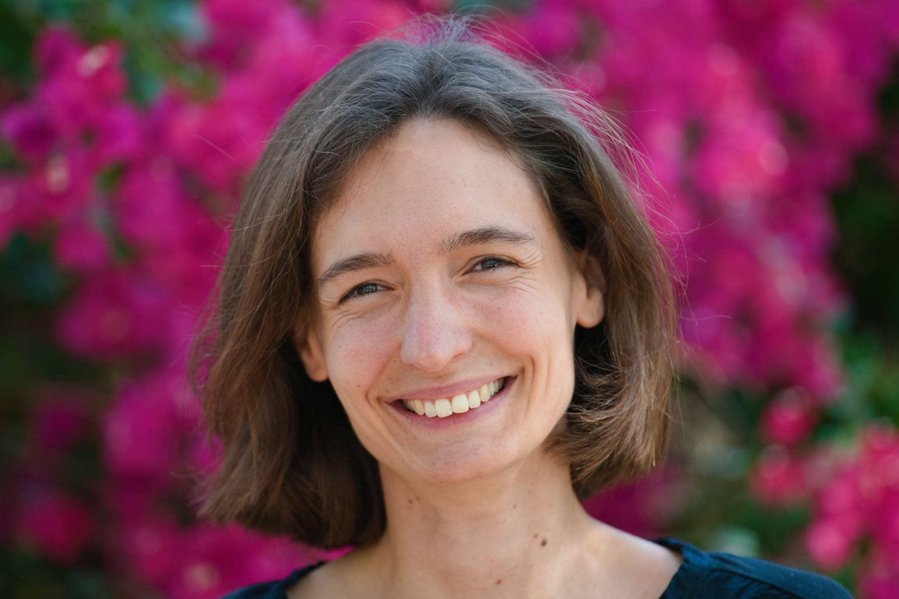
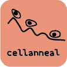

### Welcome!

I am professor of Systems Biology of Infectious Diseases at the Department of Infectious Diseases and Intensive Care at Charité - University Medicine, Berlin.  

Previously, I worked as a Senior Computational Biologist and Project Team Lead at immunai, Inc. in Tel Aviv. Before that, I was a postdoctoral research fellow at the Weizmann Institute of Science and a PhD student at the German Cancer Research Center.  

As a computational biologist with a background in physics, I develop computational methods for omics data, analyse such data, and build mathematical models of biological systems with a focus on the immune system.

You can contact me via [email](mailto:lisa.buchauer@charite.de) or [twitter](http://twitter.com/libuchauer).

### Open positions in my lab
Several PhD positions as well opportunities for master's theses and lab rotation projects will open in my lab soon (summer/autumn 2023). If you are interested, I invite you to check out the [lab](https://libuchauer.github.io/lab/) page and get in touch as soon as possible.

### cellanneal

If you have bulk RNAseq data that you want to deconvolve and are looking for a method that is accurate, fast and, above all, user-friendly, please check out [cellanneal](https://github.com/LiBuchauer/cellanneal) and the accompanying [pre-print](https://arxiv.org/abs/2110.08209)

