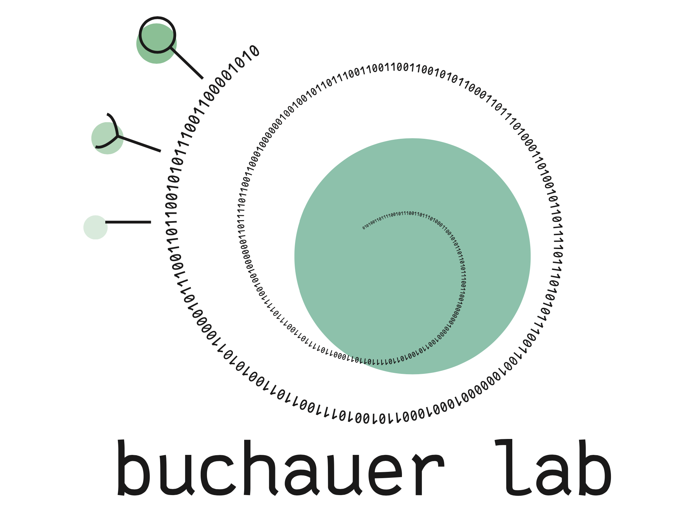

### Welcome!

We are a theoretical research group working in computational immunology. We develop computational tools for the analysis of omics and flow data. We also collaborate with experimentalists and clinicians on translational infectious disease & fundamental immunology research projects. 

Our research includes analyzing, modeling, and interpreting high-dimensional biomedical datasets, comprising single-cell or bulk omics assays, spatial assays, flow cytometry data and more. Approaches employed by and developed in our lab include - but are not limited to - mathematical models, computer simulations, and machine learning methods. 

In computational method development, our primary objective is to create tools that facilitate the informative fusion of data from various sources, such as different modalities, technologies or diseases. We conceive, prototype and develop algorithms to this end, but also emphasize thorough benchmarking, usability, reproducibility and maintenance.

### News
__March 31st 2026__
An interview with Roberta and Lisa, in which we discussed our science communication project, the printable escape game ["Purpurnägel"](https://libuchauer.github.io/resources) as well as the ongoing effort to turn it into a board game, was published in [Forschung & Lehre](https://www.forschung-und-lehre.de/forschung/spielerische-spurensuche-und-die-erforschung-neuartiger-erreger-7593).

__March 19th 2026__
We are happy to have contributed software and analyses to two recent [publications](https://libuchauer.github.io/publications) in infectious diseases, one on HIV reservoir detection lead by the [Gaebler lab](https://www.gaebler-lab.com/) and one on infectivity of emerging variants of H5N1 influenza viruses lead by the [Hocke lab](https://infektiologie-pneumologie.charite.de/hocke_group).

__March 16th 2026__
Welcome [Mohammad](https://libuchauer.github.io/team), who has joined us as a student assistant and will help with curation and processing of omics data for the TRR 418 "Foundations of Circadian Medicine"!

__March 5th 2026__
We are thrilled that our outreach project ["Purpurnägel - ein immunologisches Rätselabenteuer"](https://www.hochschulwettbewerb.net/2026/blog/die-gewinnerinnen-2026-stehen-fest/) has received an outreach award as part of the German science year "Medicine of the Future"! This will allow us to further develop our [prototype](https://libuchauer.github.io/resources) into a boxed escape game.

__January 7th 2026__
We are currently looking for a new PhD student in Machine Learning for Immunology together with the lab of Simon Haas as part of the new [Einstein Center for Early Disease Interception](https://www.einsteinfoundation.de/en/fellows-projects/einstein-centers/einstein-center-for-early-disease-interception). The desired start date is March or April 2026. Check out the [details](https://libuchauer.github.io/join) and apply!

__For older items, see the [Lab Chronicle](https://libuchauer.github.io/chronicle).__

