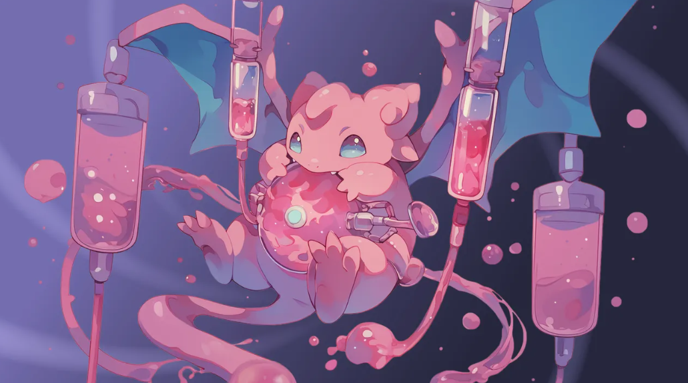
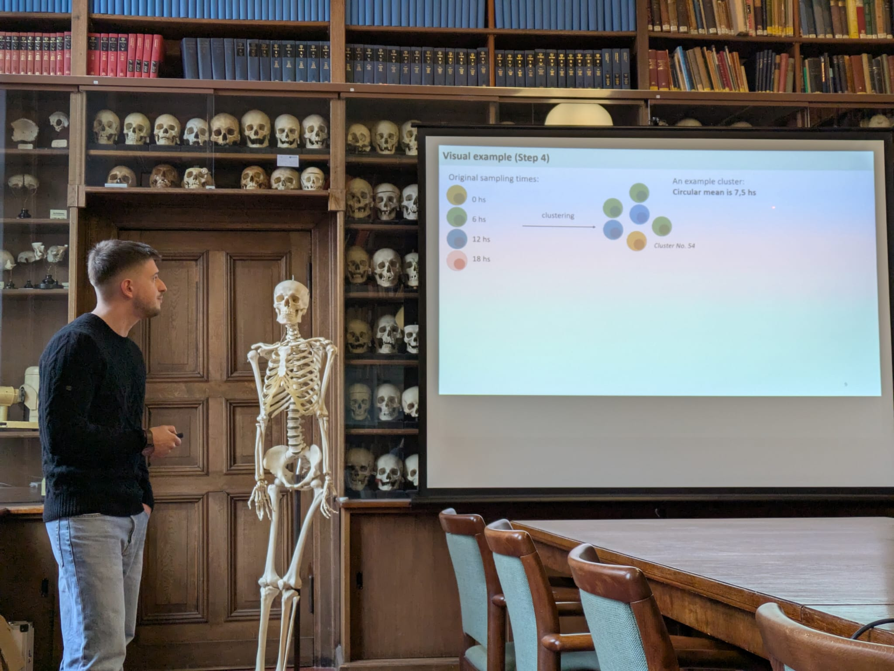
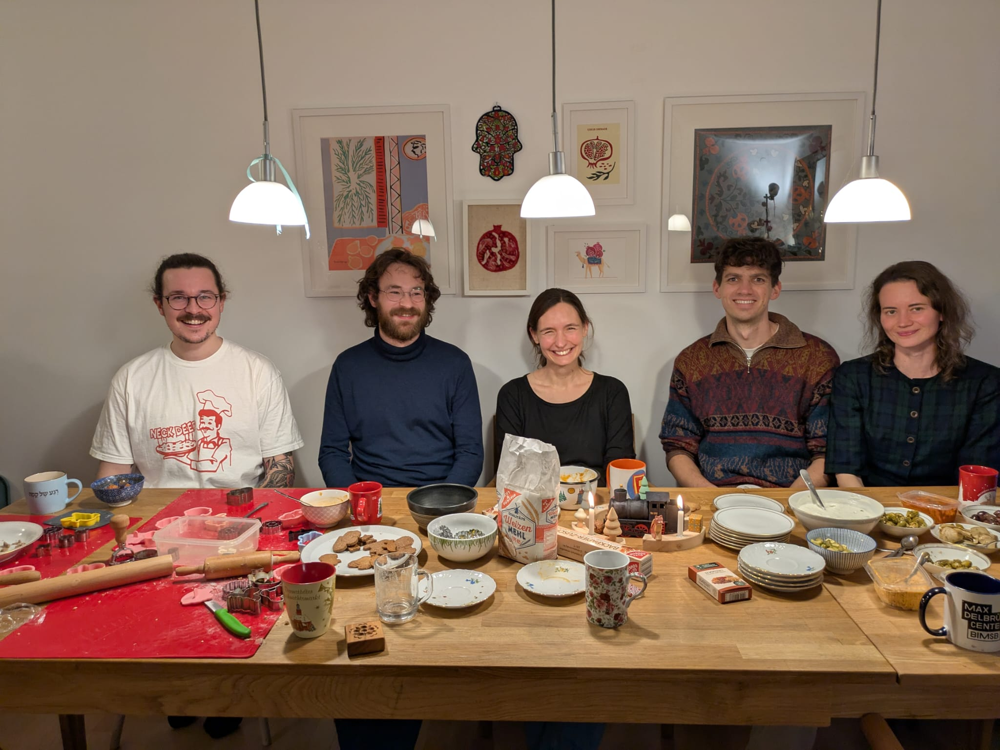

### Welcome!

We are a theoretical research group working in computational immunology. We develop computational tools for the analysis of omics and flow data. We also collaborate with experimentalists and clinicians on translational infectious disease & fundamental immunology research projects. 

Our research includes analyzing, modeling, and interpreting high-dimensional biomedical datasets, comprising single-cell or bulk omics assays, spatial assays, flow cytometry data and more. Approaches employed by and developed in our lab include - but are not limited to - mathematical models, computer simulations, and machine learning methods. 

In computational method development, our primary objective is to create tools that facilitate the informative fusion of data from various sources, such as different modalities, technologies or diseases. We conceive, prototype and develop algorithms to this end, but also emphasize thorough benchmarking, usability, reproducibility and maintenance.

### News
__August 19th 2024__
Welcome [Roberta](https://libuchauer.github.io/team), who is joining us for her MD thesis research!

__February 1st 2025__
Welcome [Ishminder](https://libuchauer.github.io/team), who is joining us for his master's thesis in Molecular Medicine!

__January 18th 2025__
As a member of the [Young Academy](https://www.diejungeakademie.de), Lisa participated in the BBAW's scientific new year's reception, the [Salon Sophie Charlotte](https://salon.bbaw.de/start). This year's event was themed "Metamorphoses", and the members of the Young Academy invited visitors to engange with their research via a specially designed card game, [MetaMonster](https://diejungeakademie.de/de/projekte/salon-sophie-charlotte/salon-sophie-charlotte-2025). 
  

  
__January 17th 2025__
Congratulations to George, who successfully defended his master's thesis entitled "High-resolution reconstruction of circadian gene expression profiles from sparse single-cell data" as part of his studies in Molecular Medicine! First graduate from the lab :-)
  

 
__December 13th 2024__
To celebrate the end of the year, we baked a lot of cookies and Stockbrot!
  

  
__August 19th 2024__
Welcome [Ani](https://libuchauer.github.io/team), who is joining us for a lab rotation as part of her M. Sc. studies in Molecular Medicine!

__June 24th 2024__
[Lisa]((https://libuchauer.github.io/team)) was admitted to the ["Junge Akademie"](https://www.diejungeakademie.de/en/press/zehn-neue-mitglieder-in-junge-akademie-aufgenommen), the German academy for Early Career Researchers supported by the Berlin-Brandenburg Academy of Sciences (BBAW) and the German National Academy of Sciences Leopoldina. For five years, she will have the opportunity to engage in interdisciplinary projects at the interface of science and society. Read Charité's press release [here](https://www.charite.de/forschung/themen_forschung/2024/lisa_buchauer_ist_mitglied_der_jungen_akademie/).

__For older items, see the [Lab Chronicle](https://libuchauer.github.io/chronicle).__

