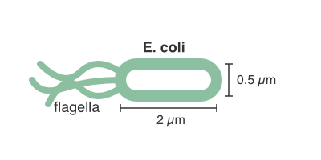
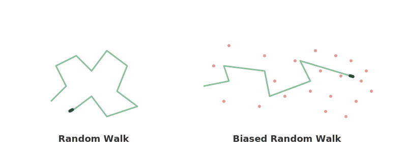
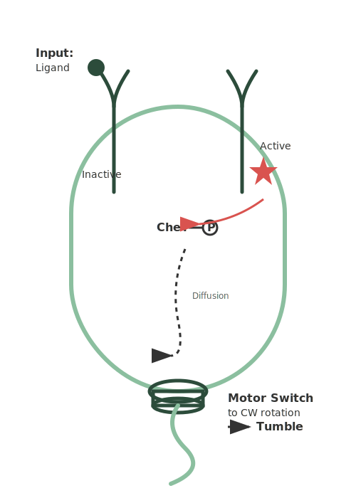
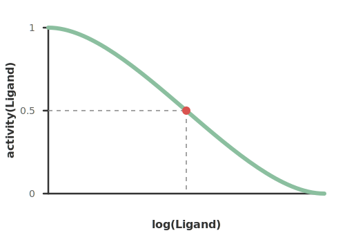
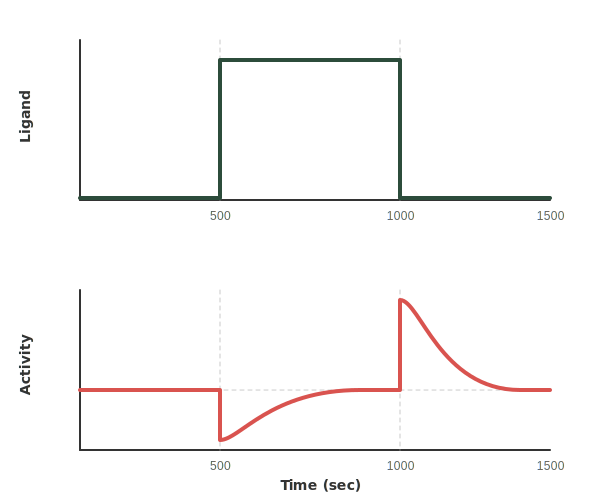
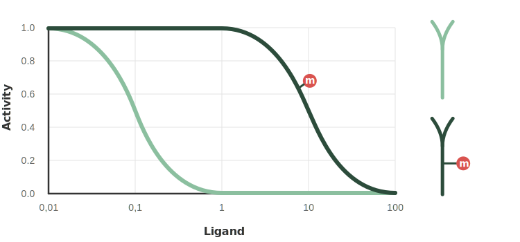
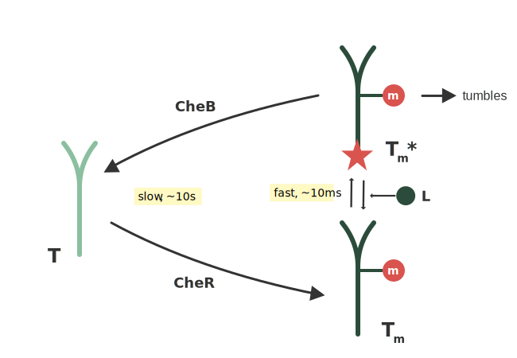
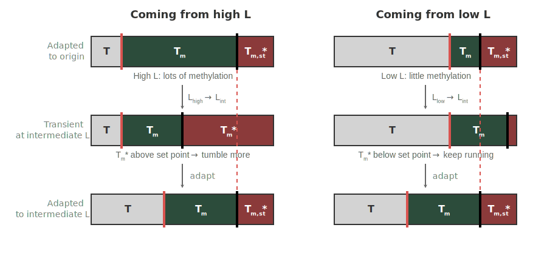
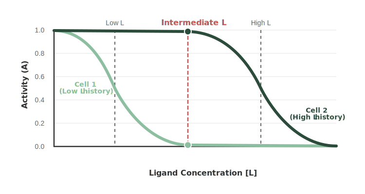

## Modeling Signal Transduction in Bacterial Chemotaxis

Chemotaxis is the directed movement of cells or organisms along a chemical concentration gradient. For a cell to navigate such a gradient, it must first be able to sense it. While some larger eukaryotic cells, such as neutrophils or amoebae, are large enough to measure spatial concentration differences across the length of their cell bodies, bacteria are typically too small to do so.

<figure>
  
  <figcaption>An <em>E. coli</em> cell, roughly 2 µm long and 0.5 µm wide, propelled by a bundle of rotating flagella.</figcaption>
</figure>

A typical *Escherichia coli* cell is approximately 2 µm long and 0.5 µm wide. At this microscopic scale, the difference in chemoattractant concentration between the front and the back of the bacterium is so small that it is drowned out by the stochastic noise of molecules binding to its surface receptors. This was demonstrated in a [classic 1977 biophysics paper](https://www.sciencedirect.com/science/article/pii/S0006349577855446?via%3Dihub) by Howard Berg and Edward Purcell.

Because spatial sensing is unfeasible, *E. coli* must sense gradients in time. The bacterium must compare the concentration of its current environment to the concentration it experienced a moment ago. This temporal comparison requires the biochemical equivalent of a short-term memory.

### Movement: Runs and Tumbles

Both to acquire and to act on this gradient information, *E. coli* must move actively. The bacterium propels itself using several rotating flagella (typically around five) extending from its body. The cell's movement is dictated entirely by the rotational direction of these flagella:

- **The "Run":** By default, all flagella rotate counter-clockwise (CCW). When rotating in this direction, the flagella wrap together to form a tight bundle, propelling the bacterium smoothly forward in a more or less straight line. A typical run lasts 1 second.
- **The "Tumble":** If a single flagellum reverses its rotation to clockwise (CW), the bundle breaks apart. The flagella splay outward in different directions, bringing the forward run to a halt and causing the bacterium to randomly tumble in place. A typical tumble lasts 0.1s and is followed by a new run in a direction independent to that of the previous one.

### The Biased Random Walk

<figure>
  
  <figcaption>An <em>E. coli</em> trajectory consisting of straight runs interrupted by tumbles that randomly reorient the next run. In a homogeneous environment this produces an unbiased random walk; in a gradient, suppressed tumbling during favorable runs biases the walk toward the source.</figcaption>
</figure>

In a homogeneous environment with no chemical gradients, *E. coli* alternates continuously between these two states, executing a purely stochastic random walk. After each tumble, the bacterium faces a new, random direction for its next run.

However, when a nutrient gradient is present, the bacterium modulates this behavior. If the cell senses that the attractant concentration is increasing over time during a single run (meaning it is swimming up the gradient), it actively suppresses the tumbling frequency ($$f_{\text{tumble}}$$ goes down). By tumbling later when moving in a favorable direction, the cell extends its productive runs. This simple suppression transforms the standard random walk into a biased random walk, allowing the bacterial population to gradually drift toward the food source.

### Inside the Cell: The (simplified!) signaling network

To understand how *E. coli* successfully modulates its tumbling frequency, we must look inside the cell at the molecular components of the chemotaxis machinery. This system consists of three primary parts: transmembrane receptors that detect the attractant, an intracellular signaling network that processes the information, and the flagellar motor that executes the physical output.

<figure>
  
  <figcaption><strong>Heavily simplified</strong> schematic of the chemotaxis signaling network: transmembrane receptors detect attractant, the active receptor state phosphorylates CheY, and CheY-P binds the flagellar motor to switch its rotation. The real network includes additional components (CheA, CheW, CheR, CheB, CheZ) and feedback loops that are omitted here for clarity.</figcaption>
</figure>

The signaling process begins at the cell surface with transmembrane receptors. These receptor proteins feature a ligand-binding domain extending into the extracellular environment and a long signaling domain reaching into the cytoplasm. The receptors are dynamic, constantly shifting between an "active" and an "inactive" structural conformation.

Somewhat counter-intuitively, the binding of a chemoattractant ligand to the outside of the receptor increases the probability that the receptor will enter the inactive state. The relationship between ligand concentration and receptor activity follows a Hill-curve: in a ligand-free environment, the receptors are highly active, but as ligand concentration increases, receptor activity goes down.

<figure>
  
  <figcaption>Receptor activity as a function of ligand concentration. Increasing ligand concentration drives the receptor toward the inactive state along a steep Hill curve.</figcaption>
</figure>

When the cytoplasmic domain of a receptor is in the active state, it initiates a phosphorylation cascade. The active receptor facilitates the phosphorylation of a cytoplasmic signaling protein called CheY. Once phosphorylated, the resulting CheY-P molecules diffuse through the cell body until they reach the motor complexes at the base of the flagella.

Upon binding to the motor complex, CheY-P acts as the molecular trigger that forces the motor to switch from its default counter-clockwise rotation (which promotes smooth running) to a clockwise rotation.

By connecting these components, we can understand the cell's baseline logic:

- **Without attractant:** Receptors are mostly active, leading to high levels of CheY-P production. This abundant CheY-P binds to the motors, causing frequent clockwise rotation and resulting in a high tumbling frequency.
- **With attractant:** Ligand binding shifts the receptors into the inactive state, halting the production of CheY-P. Without CheY-P to trigger clockwise rotation, the motors maintain their default counter-clockwise state, suppressing tumbling and extending the cell's runs.

Through this relatively simple pathway, the bacterium successfully translates the extracellular ligand concentration into a direct, mechanical behavioral output (tumbling frequency).

### The Phenomenon of Exact Adaptation

If we only consider the basic receptor-to-motor signaling pathway, we might expect that a sudden, permanent increase in attractant concentration would lead to a permanent decrease in tumbling frequency. However, experimental observations reveal a more sophisticated dynamic.

<figure>
  
  <figcaption>Response of the tumbling frequency to a sudden change in ligand concentration. The frequency drops (or spikes) within milliseconds and then recovers exactly back to its pre-stimulus baseline over the course of minutes — the hallmark of <em>exact adaptation</em>.</figcaption>
</figure>

When *E. coli* is exposed to a sudden step-increase in ligand concentration, the tumbling frequency (and the concentration of CheY-P) drops very quickly, within approximately 200 milliseconds. But rather than staying at this new, low level, the tumbling frequency slowly recovers over the next several seconds to minutes, eventually returning to the exact same baseline value it had before the attractant was added. This occurs even though the bacterium remains in the higher food concentration.

A similar but inverted process happens if the ligand concentration is suddenly reduced: the tumbling frequency immediately spikes, but then recovers back to the original baseline.

This behavior is known as *exact adaptation*. It serves an important purpose: by constantly resetting its baseline activity, the cell ensures it never becomes blind or saturated in high-nutrient environments. Because the tumbling frequency always returns to its set point, the bacterium is always ready to respond to further increases or decreases in attractant.

### Methylation: The Molecular Memory

We have now seen that i) *E. coli* needs to have a memory in order to perform a biased random walk over time and ii) that it is able to maintain a constant steady-state tumbling frequency irrespective of the absolute ligand concentration.

Both properties are brought about through methyl-accepting receptors. In addition to binding ligands on the outside of the cell, these transmembrane receptors can be modified on the inside of the cell through the addition of methyl groups (In the following, we will only discuss the addition of one methyl group per receptor, but in reality, a single receptor can be methylated in up to 4 or 5 positions, giving the system additional sensitivity).

These methyl groups act as molecular tuning dials that change the excitability of the receptor. Adding a methyl group biases the receptor toward the active state. If we compare the activity profiles of an unmethylated versus a methylated receptor, the addition of the methyl group shifts the response curve significantly to the right.

<figure>
  
  <figcaption>Adding methyl groups shifts the receptor's response curve to the right. At an intermediate ligand concentration, an unmethylated receptor is fully repressed while a methylated receptor remains active — methylation effectively re-tunes the receptor's operating range.</figcaption>
</figure>

Consequently, at an intermediate ligand concentration where an unmethylated receptor would be completely repressed (inactive), a heavily methylated receptor maintains a high level of activity, leading to more CheY-P production and more tumbling events. In this way, through chemical tagging, cells are able to store a "memory" of their recent environment.

### The Barkai-Leibler Model of Exact Adaptation

To understand how the dynamic addition and removal of methyl groups stores information and ensures a robust steady-state tumbling frequency, we can look to a [famous mathematical model proposed by Naama Barkai and Stanislav Leibler in 1997](https://www.nature.com/articles/43199).

The Barkai-Leibler model isolates the core components of the chemotaxis network into a simplified system. In this model, we start with an unmethylated receptor ($$T$$). For simplicity, the model assumes the unmethylated receptor cannot enter the active state, only methylated receptors can do so.

The system is governed by two opposing enzymes and a stark separation of timescales:

- **Methylation (slow):** An enzyme called CheR constantly adds methyl groups to the unmethylated receptors, converting them into the methylated form ($$T_m$$).
- **Ligand binding (fast):** Once methylated, the receptor can rapidly fluctuate between an inactive state ($$T_m$$) and an active state ($$T_m^*$$). As established earlier, the active state ($$T_m^*$$) leads to CheY phosphorylation and subsequent tumbling. The binding of an attractant ligand ($$L$$) rapidly shifts this equilibrium, forcing the receptors into the inactive $$T_m$$ state. This switching occurs on the order of milliseconds.
- **Demethylation (slow):** A second enzyme, CheB, removes methyl groups from the receptors. However, in the Barkai-Leibler model, there is a strict rule: CheB only demethylates receptors that are currently in the active state ($$T_m^*$$). Both methylation and demethylation occur slowly, on the order of tens of seconds.

<figure>
  
  <figcaption>The Barkai-Leibler model. CheR methylates receptors at a constant, saturated rate. The methylated receptor switches rapidly between an inactive state \(T_m\) and an active state \(T_m^*\), with ligand binding driving it toward \(T_m\). CheB demethylates only receptors in the active state \(T_m^*\).</figcaption>
</figure>

#### Steady State Analysis Reveals Excact Adaptation

Because $$T_m^*$$ is the only state that triggers tumbling, the total number of $$T_m^*$$ receptors serves as a direct proxy for the cell's physical activity. To understand how the cell adapts, we evaluate how the total pool of methylated receptors ($$T_m + T_m^*$$) changes over time.

The change in methylated receptors per unit of time is equal to the rate of methylation minus the rate of demethylation. Assuming there are vastly more receptors than CheR molecules, CheR works at a constant, saturated rate ($$\rho \cdot \mathrm{CheR}$$). Demethylation by CheB relies on Michaelis-Menten kinetics, where the rate depends on the availability of its specific substrate, the active receptor ($$T_m^*$$).

We can write this as a differential equation:

$$
\frac{d(T_m + T_m^*)}{dt} = \rho \cdot \mathrm{CheR} - \frac{\beta \cdot \mathrm{CheB} \cdot T_m^*}{K + T_m^*}
$$

To find the baseline activity of the cell after it has fully adapted to a new environment, we must solve for the steady state. By definition, in a steady state, the number of methylated receptors is no longer changing, so we set the derivative to zero:

$$
0 = \rho \cdot \mathrm{CheR} - \frac{\beta \cdot \mathrm{CheB} \cdot T_{m,\mathrm{st}}^*}{K + T_{m,\mathrm{st}}^*}
$$

If we rearrange this equation to solve for the steady-state number of active receptors ($$T_{m,\mathrm{st}}^*$$), we get:

$$
T_{m,\mathrm{st}}^* = \frac{K \cdot \rho \cdot \mathrm{CheR}}{\beta \cdot \mathrm{CheB} - \rho \cdot \mathrm{CheR}}
$$

Of note, the steady state number of methylated receptors (and therefore the activity and ultimately the tumbling frequency at steady state) depend only on constants ($$K, \beta, \rho$$) and protein copy numbers which are not themselves part of the model ($$\mathrm{CheR}, \mathrm{CheB}$$). Most importantly, the steady state $$T_{m,\mathrm{st}}^*$$ is independent of the ligand concentration ($$L$$). Because the steady-state activity is decoupled from $$L$$, the mathematical model perfectly mirrors the experimental observation: the cell's tumbling frequency will always return to the exact same set point, regardless of how much attractant is in the surrounding environment.

This works because CheB is constrained to demethylate **only the active receptors $$T_m^*$$**. That asymmetry closes a negative feedback loop: $$T_m^*$$ (the very output we want to regulate) is also the substrate that sets the rate at which methyl groups are stripped, so any rise in activity automatically accelerates the process that returns it to baseline. Had CheB demethylated all methylated receptors indiscriminately, the demethylation rate would no longer track activity, and the steady state would once again depend on ligand concentration. 

Had CheB demethylated all methylated receptors indiscriminately, the steady state would pin the total number of methylated receptors $$T_m + T_m^*$$ to a fixed value, but the partition of that total into active ($$T_m^*$$) and inactive ($$T_m$$) would then depend on ligand concentration, so there would be no fixed steady state activity.

### Using Memory to Generate the Biased Random Walk

We have established that the steady-state activity of the receptor network is independent of the attractant concentration. However, the methylation level of the receptors required to achieve that steady state is dependent on the environment: To maintain a constant level of active receptors ($$T_m^*$$), a cell in a high-ligand environment must build up a large pool of inactive methylated receptors ($$T_m$$), while a cell in a low-ligand environment requires very few.

This means the cell's current methylation level physically encodes its history. We can visualize how this historical memory influences immediate behavior by observing two cells entering the exact same intermediate concentration ($$L_\text{int}$$) from two different backgrounds.

#### The Box Model: Translating History into Behavior

Imagine two cells, Cell 1 and Cell 2, that have fully adapted to their respective environments.

- **Cell 1** is coming from a region of low attractant. To maintain baseline activity, it requires very little methylation.
- **Cell 2** is coming from a region of high attractant. It is heavily methylated to counteract the suppressive effect of the abundant ligand.

When both cells suddenly swim into the exact same intermediate concentration ($$L_\text{int}$$), the ligand binding equilibrates almost instantly (within milliseconds), but their methylation levels remain temporarily "frozen" at their historical states.

<figure>
  
  <figcaption>The box model. Each box represents the receptor population of a cell. The <strong>red horizontal line</strong> marks the methylation level — the fraction of receptors that carry methyl groups (\(T_m + T_m^*\)) — and the <strong>black horizontal lines</strong> mark how those methylated receptors split into inactive (\(T_m\)) and active (\(T_m^*\)) pools by ligand binding. The black lines can shift within milliseconds because ligand binding is fast, whereas the red line only moves on the timescale of tens of seconds, since it requires CheR or CheB to add or remove methyl groups. Cell 1 (low-ligand history) holds a small methylated pool; Cell 2 (high-ligand history) holds a large one. When both encounter the same intermediate concentration \(L_\text{int}\), the black lines snap to the new ligand-driven equilibrium immediately, but the red line lags — leaving Cell 1 with too little active receptor and Cell 2 with too much, until slow methylation catches up.</figcaption>
</figure>

- **Cell 1 (climbing the gradient):** For Cell 1, concentration $$L_\text{int}$$ is a sudden increase in food. The influx of ligand instantly forces receptors into the inactive state. Because the cell lacks the historical methylation to counteract this, the active pool ($$T_m^*$$) shrinks drastically. Tumbling is suppressed, and the cell is locked into a long, smooth run up the gradient.
- **Cell 2 (falling down the gradient):** For Cell 2, concentration $$L_\text{int}$$ is a sudden drop in food. Ligands unbind, freeing the receptors. Because the cell is still burdened with heavy historical methylation, the receptors are forced strongly into the active state. The active pool ($$T_m^*$$) expands massively. The cell immediately aborts its run and begins to tumble, effectively stopping its descent.

Over the next few seconds, the slow-acting CheR and CheB enzymes will update the memory, adding or removing methyl groups until both cells arrive at the exact same adapted state for concentration $$L_\text{int}$$.

#### The Response Curves

We can map this exact dynamic onto the receptor activity functions (the Hill curves). The slow methylation process effectively shifts the receptor's sensitivity curve along the concentration axis.

<figure>
  
  <figcaption>Receptor activity as a function of ligand concentration for cells with different methylation histories. Cell 1, with low methylation, has its response curve shifted far to the left; Cell 2, heavily methylated, has its curve shifted far to the right. At the shared intermediate concentration \(L_\text{int}\) (vertical dashed line), Cell 1's curve sits near zero activity — the cell suppresses tumbling and embarks on a long run — while Cell 2's curve sits near maximum activity, triggering an immediate tumble. Over the following seconds, methylation slowly drifts each curve toward its adapted position for \(L_\text{int}\), and the activity of both cells converges back to the common set point.</figcaption>
</figure>

Because Cell 1 has low methylation, its sensitivity curve is shifted far to the left; it requires very little ligand to shut off. Because Cell 2 has high methylation, its curve is shifted far to the right; it takes a massive amount of ligand to suppress its activity.

When we draw a vertical line representing our intermediate concentration $$L_\text{int}$$, we can see exactly why the two cells behave differently. At concentration $$L_\text{int}$$, Cell 1's curve sits near zero activity (triggering a run), while Cell 2's curve sits near maximum activity (triggering a tumble).

Through the separation of timescales — fast ligand binding and slow methylation — the bacterium's internal biochemistry generates a memory lag. This lag systematically stretches runs moving in a favorable direction and shortens runs moving in an unfavorable direction, successfully allowing a 2-micrometer cell to navigate much larger gradients.

### Further Reading

The following resources have shaped these notes and are recommended for anyone who would like to go deeper:

- Jeff Gore, [*Robustness and Bacterial Chemotaxis*](https://ocw.mit.edu/courses/8-591j-systems-biology-fall-2014/resources/robustness-and-bacterial-chemotaxis/) — lecture from MIT OCW 8.591J *Systems Biology* (Fall 2014).
- Uri Alon, *An Introduction to Systems Biology: Design Principles of Biological Circuits*, 2nd edition, Chapman & Hall/CRC Mathematical and Computational Biology, CRC Press, Boca Raton, 2019, Chapter 7.
- Jens Timmer, [*Design Principles of a Bacterial Signalling Network*](https://jeti.uni-freiburg.de/vorles_mathbio_sysbio/chemotaxis_bw.pdf) — lecture notes, University of Freiburg.
- Howard Berg, [*Marvels of Bacterial Behavior*](https://www.youtube.com/watch?v=ioA1yuIA-t8) — lecture (YouTube).

*This full-text lecture script was cleaned up from the original notes using Claude Opus. The figures were generated from hand-drawn drafts using Gemini Pro.*

