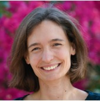
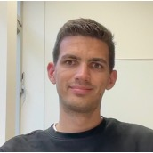

### Current group members

|                | 
|:----------------------------------------------------------------------------------| 
| Lisa Buchauer                                                                     |
| [email](mailto:lisa.buchauer@charite.de)                                          |
| _Group leader_                                                                    |
| Previously: see [CV](https://libuchauer.github.io/CV/)                            |

|                    | 
|:-----------------------------------------------------------------------------------------| 
| Roberta Colapietro                                                                       |
| [email](mailto:roberta.colapietro@charite.de)                                                                                            |
| _MD student (Medicine, Charité)_                                                         |
| Previously: Medicine (University of Pavia, Italy)                                        |
| Research interests: Computational biomedicine, chronobiology, cancer biology, metabolism |

|                                                                      | 
|:---------------------------------------------------------------------------------------------------------------------------------------| 
| Ishminder Singh Dhamrait                                                                                                               |
| [email](mailto:ishminder-singh.dhamrait@charite.de)                                                                                    |
| _Master's thesis researcher (M.Sc. Molecular Medicine, Charité)_                                                                       |
| Previously: B.Sc. Biomedical Sciences (Leeds Beckett University, UK)                                                                   |
| Research interests: Circadian regulation of immune responses, host-pathogen interactions, and cancer; single-cell transcriptomics data |

|                             | 
|:-----------------------------------------------------------------------------------------------| 
| Mark Melzer                                                                                    |
| [email](mailto:mark.melzer@charite.de)                                                         |
| _PhD student_                                                                                  |
| Previously: M.Sc. Bioinformatics (Tübingen), B.Sc. Integrated Life Science (Erlangen-Nürnberg) |
| Research interests: computational cytometry, cross-modality data integration, explainable ML   |

|                                                    | 
|:------------------------------------------------------------------------------------------------------------------------| 
| Victor Sikora                                                                                                           |
| [email](mailto:victor.sikora@bih-charite.de)                                                                            |
| _PhD student_                                                                                                           |
| Previously: M. Sc. Bioinformatics (FU Berlin), B. Sc. Biochemistry (FU Berlin)                                          |
| Research interests: biomedical data science, immune response to vaccination, mechanistic insights from single-cell data |

|                  | 
|:-----------------------------------------------------------------------------------------| 
| Jonathan Speh                                                                            |
| [email](mailto:michel-jonathan.speh@charite.de)                                          |
| _MD student (Medicine, Charité)_                                                         |
| Previously: B. Sc. Bioscience (Högskolan i Skövde, Sweden)                               |
| Research interests: transcriptomics of the immune system, infectious disease diagnostics |

### Past group members

|                                                                                                                | 
|:---------------------------------------------------------------------------------------------------------------| 
| Georgios Megalovasilis                                                                                         |
| Role in the lab: Master's thesis researcher (M.Sc. Molecular Medicine, Charité)                                |
| Previously: B. Sc. Biology (University of Patras, Greece)                                                      |

|                                                                                                    | 
|:---------------------------------------------------------------------------------------------------| 
| Ani Shubitidze                                                                                     |
| Role in the lab: Lab rotation student (M. Sc. Molecular Medicine, Charité)                         |
| Previously: B. Sc. Biology (HU Berlin)                                                             |

|                                                                                                       | 
|:------------------------------------------------------------------------------------------------------| 
| Elton Ugbogu                                                                                          |
| Role in the lab: Lab rotation student (M. Sc. Bioinformatics, University of Potsdam), 04/2024-09/2024 |
| Previously: B. Sc Microbiology (Obafemi Awolowo University, Nigeria)                                  |

|                                                                                                                 | 
|:----------------------------------------------------------------------------------------------------------------| 
| Alice Leclaire                                                                                                  |
| Role in the lab: Lab rotation student (M.Sc. Health IT Engineering, Polytech Grenoble, France), 04/2024-08/2024 |
| Previously: Preparation in Physics and Chemistry (Polytech Grenoble)                                            |

|                                                                                             | 
|:--------------------------------------------------------------------------------------------| 
| Mae Covacevich Vidalle                                                                      |
| Role in the lab: Lab rotation student (M. Sc. Molecular Medicine, Charité), 03/2024-07/2024 |
| Previously: B. Sc. Biochemistry (Fort Worth, Texas, USA)                                    |

|                                                                                                        |
|:-----------------------------------------------------------------------------------------------------------------------| 
| Liliia Khadeeva                                                                                                        |
| Role in the lab: Research project associate, 12/2023 - 05/2024                                                         |
| Previously: M.Sc. Mathematical Modeling and Computer Science (Moscow), B.Sc. Applied Mathematics and Informatics (Ufa) |
